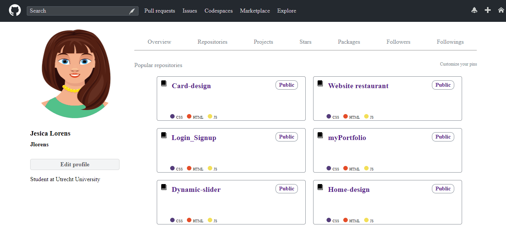

# SCSS-github-homepage

<h3>This site is made by using HTML and SCSS .</h3>

<h3>Additionally I used <a href="https://icomoon.io/#docs/font-face"><b>IcoMoon App</b> </a> (for icons) </h3>

<h3> I used <a href="https://fonts.google.com/"><b>Google font</b></a>: 'Maven Pro', sans-serif</h3>

<h3>Preview:</h3>

Enjoy Coding ❤

